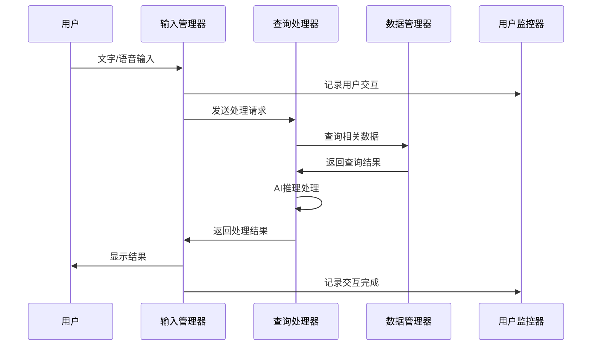
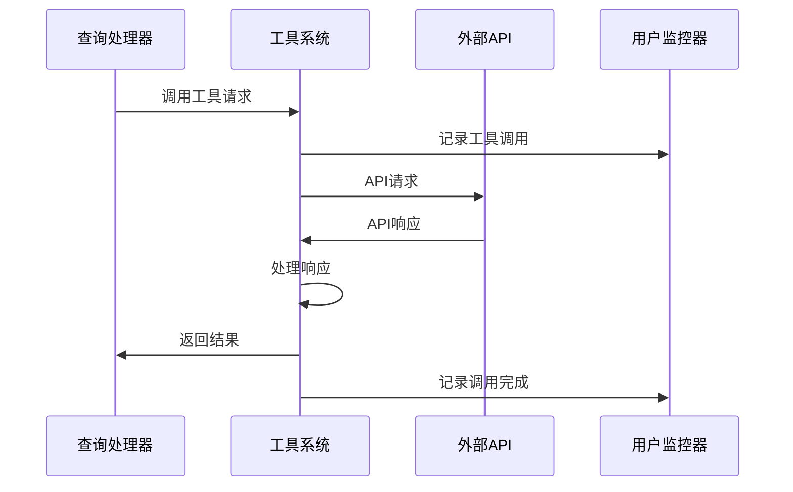
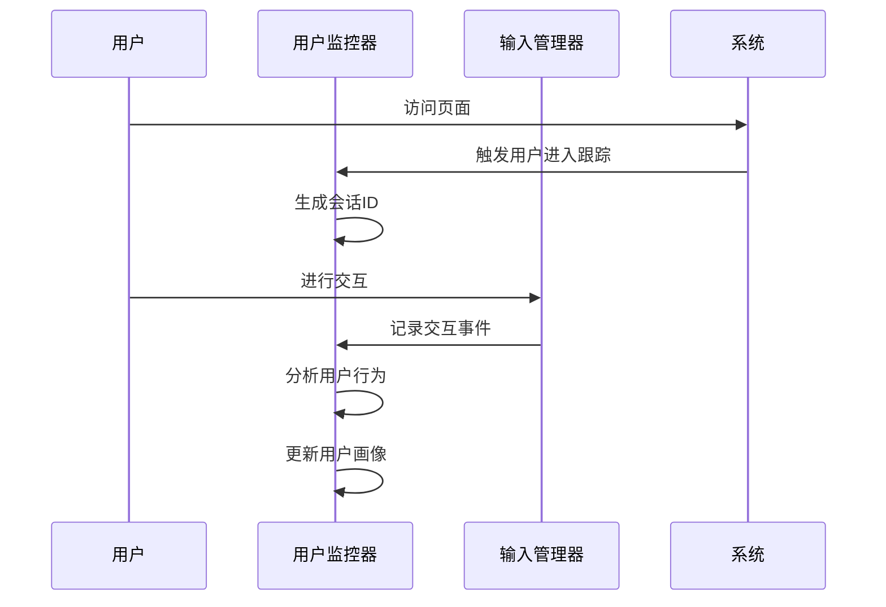

# 🔄 东里村智能导游系统 - ANP通信协议规范

## 🎯 协议概述

本文档定义东里村四人组Agent之间的标准化通信协议，确保消息传递的规范化、可扩展性和易于调试。

---

## 📋 Agent注册表

### 🔍 输入管理器 (input_manager)
```json
{
  "agent_id": "input_manager",
  "name": "输入管理器",
  "version": "1.0.0",
  "role": "用户输入检测和模式管理",
  "capabilities": [
    "文字输入检测",
    "语音输入检测", 
    "模式切换管理",
    "输入预处理",
    "防抖动处理",
    "输入状态监控"
  ],
  "message_handlers": [
    {
      "message_type": "INPUT_MODE_REQUEST",
      "handler": "handle_mode_switch",
      "response_type": "MODE_SWITCH_RESPONSE"
    },
    {
      "message_type": "INPUT_STATUS_QUERY",
      "handler": "handle_status_query", 
      "response_type": "STATUS_REPORT"
    },
    {
      "message_type": "INPUT_CONFIG_UPDATE",
      "handler": "handle_config_update",
      "response_type": "CONFIG_UPDATE_RESPONSE"
    }
  ]
}
```

### 🧠 查询处理器 (query_processor)
```json
{
  "agent_id": "query_processor",
  "name": "查询处理器",
  "version": "1.0.0",
  "role": "查询处理和答案生成",
  "capabilities": [
    "查询分析",
    "工具调用",
    "AI推理",
    "答案生成",
    "成本控制",
    "结果缓存"
  ],
  "message_handlers": [
    {
      "message_type": "QUERY_PROCESS_REQUEST",
      "handler": "handle_query_processing",
      "response_type": "QUERY_PROCESS_RESPONSE"
    },
    {
      "message_type": "TOOL_CALL_REQUEST",
      "handler": "handle_tool_call",
      "response_type": "TOOL_CALL_RESPONSE"
    },
    {
      "message_type": "PLUGIN_REGISTER_REQUEST",
      "handler": "handle_plugin_registration",
      "response_type": "PLUGIN_REGISTER_RESPONSE"
    },
    {
      "message_type": "COST_CONTROL_REQUEST",
      "handler": "handle_cost_control",
      "response_type": "COST_CONTROL_RESPONSE"
    }
  ]
}
```

### 📚 数据管理器 (data_manager)
```json
{
  "agent_id": "data_manager",
  "name": "数据管理器",
  "version": "1.0.0",
  "role": "数据存储、查询和缓存管理",
  "capabilities": [
    "数据存储",
    "快速查询",
    "缓存管理",
    "数据完整性检查",
    "索引优化",
    "数据同步"
  ],
  "message_handlers": [
    {
      "message_type": "DATA_QUERY_REQUEST",
      "handler": "handle_data_query",
      "response_type": "DATA_QUERY_RESPONSE"
    },
    {
      "message_type": "DATA_STORE_REQUEST",
      "handler": "handle_data_store",
      "response_type": "DATA_STORE_RESPONSE"
    },
    {
      "message_type": "CACHE_MANAGE_REQUEST",
      "handler": "handle_cache_operation",
      "response_type": "CACHE_MANAGE_RESPONSE"
    },
    {
      "message_type": "INDEX_UPDATE_REQUEST",
      "handler": "handle_index_update",
      "response_type": "INDEX_UPDATE_RESPONSE"
    }
  ]
}
```

### 👀 用户监控器 (user_monitor)
```json
{
  "agent_id": "user_monitor",
  "name": "用户监控器",
  "version": "1.0.0",
  "role": "用户行为监控和数据分析",
  "capabilities": [
    "用户识别",
    "行为跟踪",
    "交互记录",
    "会话管理",
    "行为分析",
    "体验监控"
  ],
  "message_handlers": [
    {
      "message_type": "USER_ENTRY_TRACK_REQUEST",
      "handler": "handle_user_entry_tracking",
      "response_type": "USER_ENTRY_TRACK_RESPONSE"
    },
    {
      "message_type": "INTERACTION_RECORD_REQUEST",
      "handler": "handle_interaction_recording",
      "response_type": "INTERACTION_RECORD_RESPONSE"
    },
    {
      "message_type": "BEHAVIOR_ANALYSIS_REQUEST",
      "handler": "handle_behavior_analysis",
      "response_type": "BEHAVIOR_ANALYSIS_RESPONSE"
    },
    {
      "message_type": "SESSION_MANAGE_REQUEST",
      "handler": "handle_session_management",
      "response_type": "SESSION_MANAGE_RESPONSE"
    }
  ]
}
```

---

## 🔧 标准消息格式

### 📨 基础消息结构
```json
{
  "protocol_version": "1.0",
  "message_id": "msg_<timestamp>_<random>",
  "timestamp": "2024-12-06T14:30:25.123Z",
  "from_agent": "agent_id",
  "to_agent": "agent_id",
  "message_type": "MESSAGE_TYPE",
  "priority": "CRITICAL|HIGH|MEDIUM|LOW",
  "payload": {
    "action": "specific_action",
    "data": { ... },
    "metadata": {
      "request_id": "req_<timestamp>",
      "session_id": "session_<uid>",
      "user_id": "user_<uid>",
      "correlation_id": "corr_<id>"
    }
  }
}
```

### 📊 消息类型定义
```json
{
  "message_types": {
    "INPUT_MODE_REQUEST": "请求切换输入模式",
    "MODE_SWITCH_RESPONSE": "输入模式切换响应",
    "INPUT_STATUS_QUERY": "查询输入状态",
    "STATUS_REPORT": "状态报告",
    "INPUT_CONFIG_UPDATE": "更新输入配置",
    "CONFIG_UPDATE_RESPONSE": "配置更新响应",
    
    "QUERY_PROCESS_REQUEST": "请求处理查询",
    "QUERY_PROCESS_RESPONSE": "查询处理响应",
    "TOOL_CALL_REQUEST": "请求调用工具",
    "TOOL_CALL_RESPONSE": "工具调用响应",
    "PLUGIN_REGISTER_REQUEST": "请求注册插件",
    "PLUGIN_REGISTER_RESPONSE": "插件注册响应",
    "COST_CONTROL_REQUEST": "请求成本控制",
    "COST_CONTROL_RESPONSE": "成本控制响应",
    
    "DATA_QUERY_REQUEST": "请求数据查询",
    "DATA_QUERY_RESPONSE": "数据查询响应",
    "DATA_STORE_REQUEST": "请求数据存储",
    "DATA_STORE_RESPONSE": "数据存储响应",
    "CACHE_MANAGE_REQUEST": "请求缓存管理",
    "CACHE_MANAGE_RESPONSE": "缓存管理响应",
    "INDEX_UPDATE_REQUEST": "请求索引更新",
    "INDEX_UPDATE_RESPONSE": "索引更新响应",
    
    "USER_ENTRY_TRACK_REQUEST": "请求用户进入跟踪",
    "USER_ENTRY_TRACK_RESPONSE": "用户进入跟踪响应",
    "INTERACTION_RECORD_REQUEST": "请求交互记录",
    "INTERACTION_RECORD_RESPONSE": "交互记录响应",
    "BEHAVIOR_ANALYSIS_REQUEST": "请求行为分析",
    "BEHAVIOR_ANALYSIS_RESPONSE": "行为分析响应",
    "SESSION_MANAGE_REQUEST": "请求会话管理",
    "SESSION_MANAGE_RESPONSE": "会话管理响应"
  }
}
```

---

## 🔌 工具调用接口规范

### 🛠️ 标准工具接口
```json
{
  "tool_interface": {
    "version": "1.0",
    "name": "tool_name",
    "description": "工具描述",
    "provider": "internal|external|mcp|plugin",
    "endpoint": "api_endpoint_url",
    "authentication": {
      "type": "api_key|oauth|none",
      "credentials": "encrypted_credentials"
    },
    "parameters": {
      "required": ["param1", "param2"],
      "optional": ["param3", "param4"],
      "schema": {
        "param1": { "type": "string", "description": "参数1描述" },
        "param2": { "type": "number", "description": "参数2描述" }
      }
    },
    "response": {
      "format": "json|xml|text",
      "schema": { ... },
      "error_handling": "retry|fallback|fail"
    },
    "rate_limit": {
      "requests_per_minute": 60,
      "requests_per_hour": 1000
    },
    "cost": {
      "per_request": 0.01,
      "currency": "CNY"
    }
  }
}
```

### 🔌 插件扩展接口
```json
{
  "plugin_interface": {
    "version": "1.0",
    "name": "plugin_name",
    "description": "插件描述",
    "type": "tool|filter|processor|output",
    "entry_point": "plugin_main_function",
    "dependencies": ["dependency1", "dependency2"],
    "permissions": ["network", "storage", "user_data"],
    "lifecycle": {
      "init": "plugin_init",
      "execute": "plugin_execute", 
      "cleanup": "plugin_cleanup"
    },
    "configuration": {
      "required": ["config1"],
      "optional": ["config2"]
    }
  }
}
```

---

## 📡 具体通信流程

### 🎤 用户输入处理流程


### 🔧 工具调用流程


### 📊 用户监控流程


---

## 🔍 通信错误处理

### ❌ 错误消息格式
```json
{
  "protocol_version": "1.0",
  "message_id": "msg_error_<timestamp>_<random>",
  "timestamp": "2024-12-06T14:30:25.123Z",
  "from_agent": "agent_id",
  "to_agent": "agent_id",
  "message_type": "ERROR_RESPONSE",
  "priority": "HIGH",
  "payload": {
    "error_code": "ERROR_CODE",
    "error_message": "错误描述",
    "error_details": { ... },
    "original_request_id": "req_<timestamp>",
    "retry_recommended": true,
    "retry_delay": 1000,
    "fallback_available": true
  }
}
```

### 🔄 重试机制
```json
{
  "retry_policy": {
    "max_retries": 3,
    "base_delay": 1000,
    "max_delay": 10000,
    "backoff_strategy": "exponential",
    "retry_conditions": [
      "NETWORK_ERROR",
      "TIMEOUT",
      "SERVICE_UNAVAILABLE"
    ],
    "no_retry_conditions": [
      "INVALID_PARAMETERS",
      "PERMISSION_DENIED",
      "AUTHENTICATION_FAILED"
    ]
  }
}
```

---

## 🛡️ 安全和隐私

### 🔐 认证机制
```json
{
  "authentication": {
    "method": "api_key",
    "key_rotation": "monthly",
    "encryption": "AES-256",
    "token_expiry": 3600,
    "refresh_token_support": true
  }
}
```

### 🛡️ 数据保护
```json
{
  "data_protection": {
    "encryption_in_transit": true,
    "encryption_at_rest": false,
    "data_minimization": true,
    "anonymization": true,
    "retention_policy": {
      "user_data": "90_days",
      "interaction_logs": "30_days",
      "error_logs": "7_days"
    }
  }
}
```

---

## 📈 监控和调试

### 📊 性能指标
```json
{
  "performance_metrics": {
    "message_latency": {
      "target": "<100ms",
      "warning_threshold": "200ms",
      "critical_threshold": "500ms"
    },
    "throughput": {
      "target": "1000_msg/min",
      "warning_threshold": "800_msg/min",
      "critical_threshold": "500_msg/min"
    },
    "error_rate": {
      "target": "<1%",
      "warning_threshold": "3%",
      "critical_threshold": "5%"
    }
  }
}
```

### 🔍 调试支持
```json
{
  "debugging": {
    "message_logging": true,
    "trace_enabled": true,
    "correlation_tracking": true,
    "performance_profiling": true,
    "error_stack_traces": true
  }
}
```

---

## 🎯 扩展性设计

### 🔌 插件系统
```json
{
  "plugin_system": {
    "supported_types": [
      "tool",
      "filter",
      "processor",
      "output_formatter"
    ],
    "loading_mechanism": "dynamic",
    "sandbox_enabled": true,
    "permission_model": "least_privilege",
    "hot_reload": true
  }
}
```

### 📡 协议版本控制
```json
{
  "version_control": {
    "current_version": "1.0",
    "backward_compatibility": ["0.9"],
    "deprecation_policy": "6_months",
    "migration_support": true
  }
}
```

---

## 📋 实现指南

### 🏗️ Agent实现步骤
1. **定义Agent接口**：实现标准消息处理器
2. **注册Agent**：向系统注册Agent信息
3. **实现业务逻辑**：根据Agent角色实现具体功能
4. **配置监控**：设置性能指标和健康检查
5. **测试集成**：验证与其他Agent的通信

### 🔌 工具实现步骤
1. **定义工具接口**：符合标准工具接口规范
2. **实现工具逻辑**：实现具体功能
3. **注册工具**：向查询处理器注册工具
4. **配置权限**：设置必要权限和限制
5. **测试调用**：验证工具调用流程

### 🔌 插件开发步骤
1. **实现插件接口**：符合插件接口规范
2. **配置权限**：声明所需权限和依赖
3. **注册插件**：向系统注册插件
4. **测试功能**：验证插件功能和安全
5. **部署发布**：热部署到生产环境

---

## 🎉 结语

### 🏆 协议特色

#### 🔄 标准化通信
- **统一消息格式**：所有Agent使用相同的消息结构
- **标准化接口**：工具和插件使用统一接口规范
- **版本控制**：支持协议演进和向后兼容
- **错误处理**：统一的错误消息和重试机制

#### 🔧 可扩展性
- **插件系统**：支持动态加载工具和处理器
- **模块化设计**：每个Agent独立，便于维护和扩展
- **接口标准化**：新功能可以无缝集成
- **配置灵活**：支持运行时配置和热更新

#### 🛡️ 安全可靠
- **认证机制**：API密钥和令牌管理
- **数据保护**：加密传输和隐私保护
- **权限控制**：最小权限原则和沙箱隔离
- **审计日志**：完整的操作记录和追踪

#### 📊 可观测性
- **性能监控**：实时指标和告警
- **调试支持**：详细日志和追踪
- **健康检查**：系统状态监控
- **错误分析**：错误统计和趋势分析

---

**东里村智能导游系统 - 标准化通信，模块化架构，可扩展设计！** 🎊
