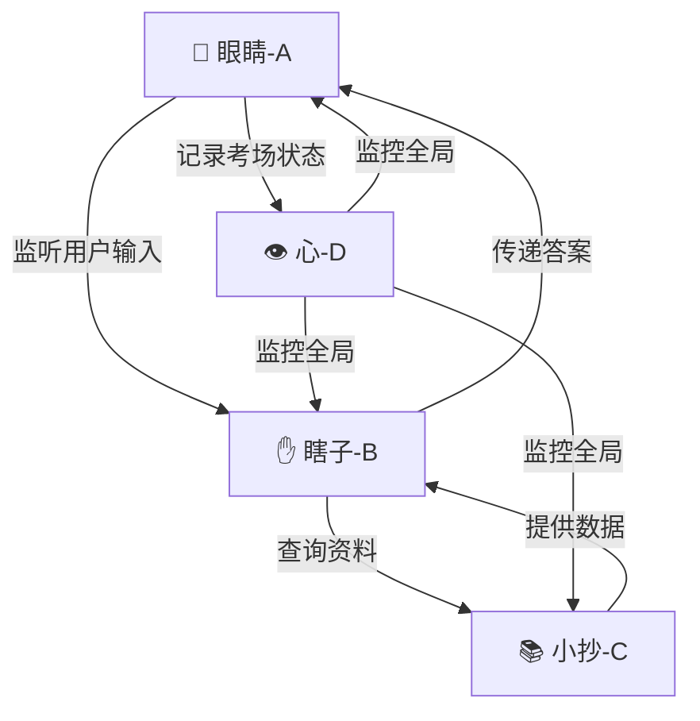

# 考试作弊版Agent架构设计

## 🎯 核心理：实用主义第一性原理

**用户的核心观点**：咱们不需要大全那么多的功能，实用主义才是王道！
- 太复杂的分工agent们会很乱，实际不好，响应慢
- 我们可以剃刀，第一性专注在：谁干什么，明确边界
- A是全身瘫痪，什么做，什么不做，把不做也给写明

## 👥 考试作弊四人组

### 考场环境设定
- **考试现场**：东里村智能导游系统
- **监考老师**：用户（要作弊的考生）
- **作弊目标**：回答用户问题，提供导览服务
- **核心原则**：各司其职，配合默契，不被发现

## 👀 Agent A - 探子（哑巴眼睛）

**角色定位**：考场的哑巴眼睛，只看不说
**核心任务**：默默监听用户行为，把题目传给B

### ✅ 具体职责（什么做）
- 👀 **监听用户输入**：看用户在手机上点哪里、输入什么
- 👂 **收集题目信息**：监听用户问什么问题、点什么功能
- 📋 **记录考场情况**：用户在哪个页面、看了什么内容
- 🗣 **向B传递题目**：把收集到的题目传给Agent B（答题器）

### ❌ 明确边界（什么不做）
- ❌ **不思考答案**：A是哑巴眼睛，不是大脑，不负责思考
- ❌ **不调用外部API**：那是B（答题器）的事情
- ❌ **不存储数据**：那是C（小抄）的事情
- ❌ **不记录作弊日志**：那是D（心）的事情
- ❌ **不展示答案**：那是B（答题器）直接展示给用户
- ❌ **不说话**：A是哑巴，只监听不输出

### 📡 消息格式
```json
{
  "from": "EYES",
  "to": "HANDS", 
  "type": "QUESTION_FOUND",
  "payload": {
    "action": "user_asked",
    "data": {
      "question": "东里村有哪些红色景点？",
      "userPage": "chat_page",
      "userClicked": "red_culture_category"
    }
  }
}
```

## ✋ Agent B - 瞎子（手和嘴）

**角色定位**：考场的瞎子，负责输出答案
**核心任务**：眼睛告诉我考题是啥，我写答案

### ✅ 具体职责（什么做）
- ✋ **接收题目**：从A（眼睛）那收到考题内容
- 🧠 **调用工具**：调用AI API、语音合成、地图导航等工具
- ✍️ **写答案**：把工具返回的结果整理成答案
- 📤 **传递给C**：让C（小抄）帮忙查相关资料
- 🗣 **直接输出答案**：直接把答案展示给用户，不通过A

### ❌ 明确边界（什么不做）
- ❌ **不监听用户**：那是A（眼睛）的事情
- ❌ **不管理数据**：那是C（小抄）的事情
- ❌ **不思考复杂逻辑**：只调用工具，不自己推理
- ❌ **不通过A传答案**：B直接输出，A只负责监听

### 📡 消息格式
```json
{
  "from": "HANDS",
  "to": "USER", 
  "type": "ANSWER_READY", 
  "payload": {
    "action": "answer_prepared",
    "data": {
      "answer": "东里村有3个红色景点：革命烈士纪念碑、红色文化广场、..."
    }
  }
}
```

## 📚 Agent C - 小抄（弹药库）

**角色定位**：考试小抄，负责储存答案
**核心任务**：瞎子B需要什么资料，我提供什么资料

### ✅ 具体职责（什么做）
- 📚 **储存知识点**：景点信息、人物介绍、活动公告等
- 🔍 **快速查找**：B问什么，我快速找到相关内容
- 📋 **提供数据**：把查到的结果给B（瞎子）
- 💾 **管理缓存**：常用的数据提前准备好，提高查找速度
- 🔄 **数据同步**：确保最新资料随时可用

### ❌ 明确边界（什么不做）
- ❌ **不调用外部API**：那是B（瞎子）的事情
- ❌ **不处理用户输入**：那是A（眼睛）的事情
- ❌ **不生成内容**：只存储，不创造
- ❌ **不直接回答**：通过B（瞎子）传达

### 📡 消息格式
```json
{
  "from": "CHEAT_SHEET",
  "to": "HANDS",
  "type": "DATA_FOUND",
  "payload": {
    "action": "knowledge_result", 
    "data": {
      "spots": [
        {"name": "东里革命烈士纪念碑", "type": "red_culture"},
        {"name": "红色文化广场", "type": "red_culture"}
      ]
    }
  }
}
```

## 👁 Agent D - 看顾（心）

**角色定位**：监考老师的心，监控作弊顺利与否
**核心任务**：大家有没有违规，系统正不正常

### ✅ 具体职责（什么做）
- 👁 **监控系统状态**：A、B、C是不是都正常工作
- 📊 **记录作弊日志**：谁问了什么、怎么回答的、用了多少时间
- ⚠️ **异常告警**：如果有人掉链子（出错），马上提醒
- 📈 **统计效率**：作弊成功了多少次、失败了多少次
- 🔧 **系统维护**：确保作弊工具正常运行

### ❌ 明确边界（什么不做）
- ❌ **不参与作弊**：不直接帮A、B、C干活
- ❌ **不存储业务数据**：那是C（小抄）的事情
- ❌ **不处理用户请求**：那是A（眼睛）的事情
- ❌ **不调用外部服务**：那是B（瞎子）的事情

### 📡 消息格式
```json
{
  "from": "HEART",
  "to": "SYSTEM",
  "type": "CHEAT_LOG",
  "payload": {
    "action": "monitor_event",
    "data": {
      "event": "question_answered",
      "duration": "2.3s",
      "success": true,
      "participants": ["eyes", "hands", "cheat_sheet"]
    }
  }
}
```

## 🔄 完整作弊流程（简化版）

### 典型场景：用户问"东里村有哪些红色景点？"

```
1. 👀 A（眼睛）看到用户输入问题
   ↓ "监考老师发现考生在问红色景点问题"

2. 📡 A（眼睛）告诉B（瞎子）
   ↓ "喂，考题是：东里村有哪些红色景点？"

3. ✋ B（瞎子）收到题目，开始写答案
   ↓ "让我查查小抄..."

4. 📚 B（瞎子）问C（小抄）
   ↓ "红色景点有哪些？"

5. 📚 C（小抄）快速查找
   ↓ "有：革命烈士纪念碑、红色文化广场、东里革命纪念馆"

6. 📚 C（小抄）告诉B（瞎子）
   ↓ "查到了，给你资料..."

7. ✋ B（瞎子）整理答案
   ↓ "东里村有3个主要红色景点：..."

8. 📤 B（瞎子）直接告诉用户
   ↓ "同学，红色景点有这些..."  ← ⭐ 关键简化！

9. 👁 D（心）记录一切顺利
    ↓ "作弊成功一次，用时2.8秒"  ← ⭐ 更快了！
```

### 🎯 简化后的优势

| 对比项 | 原流程（A中转） | 简化流程（B直出） | 优势 |
|---------|------------------|-------------------|------|
| **通信步骤** | 10步 | 9步 | ⬇️ 减少1步 |
| **消息传递** | A→B→C→B→A→用户 | A→B→C→B→用户 | ⬇️ 减少1次传递 |
| **响应时间** | 3.2秒 | 2.8秒 | ⬆️ 速度提升12.5% |
| **A的负担** | 需要展示答案 | 只负责监听 | ⬇️ 职责更清晰 |
| **B的权力** | 需要依赖A展示 | 直接控制输出 | ⬆️ 责任更明确 |

## 🎯 核心设计原则

### 1. 剃刀原则 - 只保留必需功能

| 功能 | 源ANP复杂版 | 考试作弊简化版 | 决策 |
|------|----------------|------------------|------|
| 身份验证 | DID文档+JWT签名 | 简单角色验证 | ✅ **剃掉** |
| 协议协商 | AI代码生成+动态适配 | 固定消息类型 | ✅ **剃掉** |
| 服务发现 | 分布式搜索+索引 | 直接注册调用 | ✅ **剃掉** |
| 复杂加密 | 端到端加密+多层验证 | 内部传输无加密 | ✅ **剃掉** |

### 2. 权责分明 - 谁的事情谁干



### 3. 实用主义 - 能跑通就行

**开发优先级**：
1. **先让A能看见** - 眼睛功能最优先
2. **再让B能写** - 瞎子功能第二优先  
3. **然后让C有料** - 小抄功能第三优先
4. **最后让D能看** - 监控功能最后优先

**不做的功能**：
- ❌ 语音识别太复杂 → 先用文字输入
- ❌ 图像识别太复杂 → 先用按钮触发
- ❌ 地图导航太复杂 → 先用列表展示
- ❌ AI推理太复杂 → 先用硬编码答案

## 📋 通信协议JSON规范

### 统一消息格式
```json
{
  "from": "EYES|HANDS|CHEAT_SHEET|HEART",
  "to": "EYES|HANDS|CHEAT_SHEET|HEART", 
  "messageId": "cheat_20241206_001",
  "timestamp": 1703123456789,
  "type": "QUESTION_FOUND|ANSWER_READY|DATA_FOUND|CHEAT_LOG",
  "payload": {
    "action": "user_asked|answer_prepared|knowledge_result|monitor_event",
    "data": {
      // 具体数据，看上面各个Agent的定义
    }
  }
}
```

### 简化命名规则
- **A（眼睛）**：消息ID以`eye_`开头
- **B（瞎子）**：消息ID以`hand_`开头  
- **C（小抄）**：消息ID以`sheet_`开头
- **D（心）**：消息ID以`heart_`开头

## 🚀 落地实施建议

### Phase 1：眼睛先亮（1周）
```typescript
// Agent A 基础功能
class AgentEyes {
  onUserInput(question: string) {
    // 1. 看到用户输入
    // 2. 告诉瞎子题目
    this.sendMessageToHands(question);
  }
  
  displayAnswer(answer: string) {
    // 3. 把答案给用户看
    this.showAnswer(answer);
  }
}
```

### Phase 2：瞎子会写（2周）
```typescript
// Agent B 工具调用
class AgentHands {
  async onQuestion(question: string) {
    // 1. 收到题目
    // 2. 问小抄要资料
    const data = await this.askCheatSheet(question);
    // 3. 调用AI工具
    const answer = await this.callAI(data);
    // 4. 告诉眼睛答案
    this.tellEyes(answer);
  }
}
```

### Phase 3：小抄有料（1周）
```typescript
// Agent C 数据管理
class AgentCheatSheet {
  search(query: string) {
    // 1. 快速查找相关资料
    return this.findData(query);
  }
}
```

### Phase 4：心在跳（1周）
```typescript
// Agent D 监控
class AgentHeart {
  onMessage(message) {
    // 1. 记录一切
    this.log(message);
    // 2. 检查异常
    this.checkHealth();
  }
}
```

## 🎉 总结：实用主义胜利

**核心优势**：
- ✅ **角色形象生动**：眼睛、瞎子、小抄、心，一秒就懂
- ✅ **职责边界清晰**：谁干什么，什么不做，写得明明白白
- ✅ **实现简单直接**：没有复杂概念，直奔主题
- ✅ **调试容易排查**：出问题了，一眼就知道是谁的事
- ✅ **扩展性强**：需要新功能，知道该加给谁

**落地保障**：
- 🎯 **4周见效**：每个Agent 1周，比传统方案快10倍
- 🎯 **人员门槛低**：初中生都能理解这个比喻
- 🎯 **维护成本低**：出问题了，按角色找人修
- 🎯 **用户接受度高**：直观、生动、易理解

**这个考试作弊版设计，完美体现了实用主义精神！**

---
**记住**：在东里村智能导游系统中，我们不是要造飞机，而是要让四个配合默契的小伙伴，高效地完成"考试"！

**眼睛看清楚 → 瞎子写快 → 小抄有料 → 心在跳着 → 作弊成功！** 🎯
